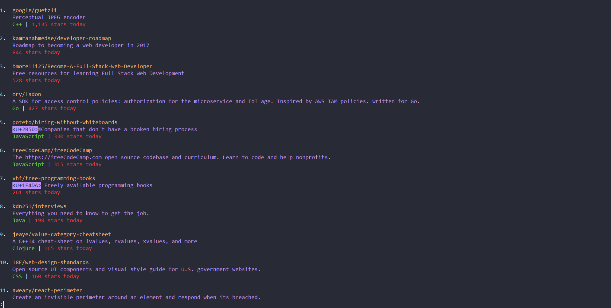
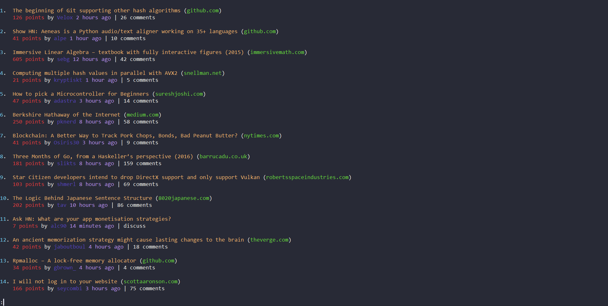

# gli

View technical news directly from your command line. Currently support [github trending](https://github.com/trending) and [hackernews](https://news.ycombinator.com)

**NOTE**: gli is currently on development, its code and architecture may change anytime in the future.

## Installation
```
go get github.com/nguyenhoaibao/gli
go build main.go
```

## Usage
```bash
// hit <Tab> to show options
gli> github hackernews clear
gli> github trending
gli> github trending <repo number>
gli> hackernews <new|show|ask|jobs|top>
gli> clear
```

## Screenshots

**Github Trending**


**Hackernews Top**

